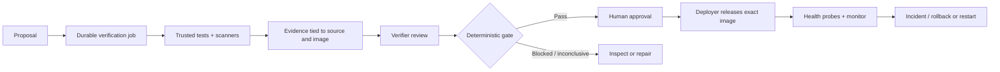

# VeriForge

### Evidence-driven assurance and recovery for AI-generated changes

[](https://github.com/Dxrksvng/VeriForge/actions/workflows/verify.yml)

VeriForge is a **local production simulation** for a narrow financial-policy workflow. It takes a proposed change through isolated checks, evidence review, a deterministic release gate, human approval, local Docker deployment, runtime monitoring, and recovery. All payments use test funds; the system is not connected to a bank or payment provider.

> ระบบนี้สาธิตการตรวจ change ที่ AI เสนอโดยผูกผลทดสอบกับ source และ artifact จริง ก่อนให้คนอนุมัติและ deploy ในเครื่อง ขอบเขตคือ sandbox ทางการเงิน ไม่ใช่ระบบรับจ่ายเงินจริง

```text
Proposal → Trusted tests & scanners → Evidence-bound decision
         → Human approval → Local release → Monitor → Recover
```

## What works today

- **Financial lab:** PostgreSQL ledger with integer money, balanced postings, concurrent idempotency, and conflict rejection.
- **Change assurance:** Builder and Verifier use separate contexts; trusted financial tests, Gitleaks, Semgrep, and Trivy feed deterministic gates. A failed or missing mandatory check cannot become a pass.
- **Controlled release:** evidence binds the source, image, and checks; operator approval and deployer identity are separate. A worker handles leases and retries.
- **Recovery:** local Docker release is probed and monitored; an injected process-stop fault can trigger rollback or restart.
- **Operator view:** React dashboard, signed and revocable sessions, HMAC-chained local audit, metrics, and model usage.
- **Reproducible evaluation:** UCI Online Retail amounts are replayed as synthetic test payments with source/transform provenance; PostgreSQL backup is restored to a separate validation database.

The verified scope is **one local tenant and two financial-policy functions**. Builder and Verifier currently use the same local model with different contexts, so their errors are not statistically independent. See [validation evidence](docs/VALIDATION.md) for what was run and what those results do *not* establish.

## Why this workflow exists

An AI-generated patch can look plausible while breaking a financial invariant, weakening a test, or changing behavior after deployment. VeriForge keeps the candidate patch separate from trusted checks and makes the release decision depend on recorded evidence. A human approves only the exact source and image that passed those checks.

The supported patch surface is deliberately small: `fee_minor` and `should_post` in a constrained Python policy module. AI cannot rewrite the trusted tests, scanner policy, deployment code, or financial ledger. Expanding to arbitrary repositories would require stronger execution isolation and a broader trust model.

## End-to-end decision path



| Decision state | Meaning |
| --- | --- |
| `BLOCKED` | A required rule or trusted check failed |
| `INCONCLUSIVE` | A required check did not produce usable evidence |
| `NEEDS_HUMAN` | A reviewer decision is required |
| `AWAITING_APPROVAL` | Checks passed; a different authorized person must approve |

The system does not convert a scanner timeout or empty report into `PASS`. A repaired proposal is a new change with its own identity and verification record.

## Run locally

Prerequisites: macOS ARM64 setup used for validation, Python 3.13, `uv`, Node 22, Docker Desktop, Ollama with `qwen3.5:9b`, and at least 3 GB free disk. First-time dependency, image, and dataset downloads need internet access; model calls run locally.

```sh
git clone https://github.com/Dxrksvng/VeriForge.git
cd VeriForge
./run-local.sh
```

Open **http://127.0.0.1:8123**. Role-specific bootstrap credentials are generated in `.local/config.json`; keep that file private and never commit it. Sign-in exchanges a bootstrap credential for an expiring session, and sign-out revokes it. Follow the [runbook](docs/RUNBOOK.md) for the exact operator/deployer journey and safe shutdown.

To run the fast local checks after dependencies are installed:

```sh
.venv/bin/ruff check src tests scripts
.venv/bin/pytest -q
cd frontend && npm run build
```

The complete lifecycle verification and data replay commands are in the runbook. Those checks can start containers and use the local model; they are not required merely to read this repository.

## Repository layout

```text
src/veriforge/        API, financial kernel, identity, assurance, worker, runtime
frontend/             React operator console and browser checks
sandbox/              Isolated policy target and acceptance harness
security/             Scanner policy
scripts/              Bootstrap, lifecycle checks, evaluation, backup
tests/                Trusted unit and integration tests
docs/                 Architecture, runbook, validation, lessons
```

The API, worker, and monitor share a local PostgreSQL database. The frontend presents evidence and decisions. The release target is a Docker container on the same machine. [Architecture](docs/ARCHITECTURE.md) documents the component and authority boundaries in detail.

## Example journey

1. Submit a failing policy proposal or load the test fixture.
2. Verify it. Inspect test, scanner, and artifact evidence; blocked/inconclusive results cannot be approved.
3. Approve an evidence-bound passing change as operator, then deploy it with the separate deployer identity.
4. Replay an idempotent test payment and observe the ledger result.
5. Inject a local process-stop fault and inspect the incident and recovery record.

This is a controlled lab. It does not execute arbitrary generated code on a production host and does not move real money.

## Evidence you can inspect

| Check | Recorded local result | What it establishes |
| --- | --- | --- |
| Backend tests | 33 passed; 2 dependency warnings | Behavior covered by the current trusted suite |
| Duplicate payment race | 24 simultaneous same-key requests produced one payment | Idempotency under that local concurrency test |
| Signed identities | 100/100 requests validated in a local load exercise | Local read-workload behavior, not 100 AI agents |
| Public-data replay | 500 synthetic payments based on transformed UCI Online Retail amounts | Repeatability of a sandbox workload, not real bank traffic |
| Lifecycle exercise | AI repair, gate, approval, local deploy, injected fault, recovery | One observed local end-to-end run |

These figures come from [the validation record](docs/VALIDATION.md) and [progress log](docs/PROGRESS.md). The run artifacts are local and excluded from Git because they may contain runtime details. The [GitHub verification workflow](.github/workflows/verify.yml) runs source checks; it does not reproduce the model-driven lifecycle or fault injection.

## Security and data boundaries

- Local role credentials live under `.local/` and are ignored by Git. Do not copy them into issues, screenshots, or commits.
- The worker runs policy acceptance tests in a restricted, networkless Docker sandbox. The API, worker, and deployer still share the owner's OS account; that is a local-lab limitation.
- HMAC evidence and audit records help detect changes made without the signing key. They are not independent attestation against a host administrator with that key.
- Real scanner runs, a public retail benchmark transformed into test amounts, synthetic replay, and injected faults are labelled as different evidence types.
- Do not aim this sandbox at an external service, actual payment account, or untrusted repository without a separate review.

## Architecture and evidence

| Document | Use it for |
| --- | --- |
| [Architecture](docs/ARCHITECTURE.md) | Components, trust boundaries, and decision flow |
| [Runbook](docs/RUNBOOK.md) | Start, operate, verify, back up, and recover |
| [Validation](docs/VALIDATION.md) | Observed tests, failures, metrics, and limitations |
| [System guide (Thai)](docs/SYSTEM-GUIDE-TH.md) | Important functions and code paths |
| [Progress](docs/PROGRESS.md) | Latest local state and next action |
| [Learning roadmap](docs/LEARNING-ROADMAP.md) | Planned teaching modules; separate from engineering status |

## Boundaries

No enterprise SLA, real-money settlement, multi-host availability, external identity provider, off-machine backup, or third-party audit attestation has been demonstrated. The local audit chain can be recomputed by someone holding both its database and signing key. Treat benchmark replay, fault injection, and real scanner executions as different kinds of evidence.

VeriForge is an independent engineering project. Do not put real credentials, customer data, or production systems into this lab without a separate security and deployment review.
