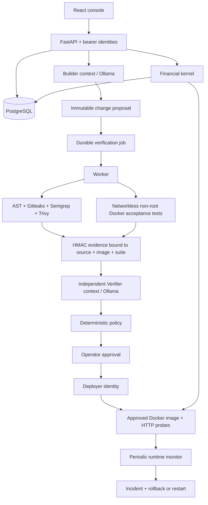

# VeriForge local production-simulation v2 — Architecture and trust boundaries

## Product boundary

VeriForge accepts a change to a bounded Python financial-policy module (`fee_minor`, `should_post`), executes independent checks, obtains an independent-context model review, requires a different approver identity, and deploys the verified Docker image to a local target. PostgreSQL stores the durable ledger, changes, evidence, jobs, releases, usage and audit events.

This is a functioning local assurance platform for one tenant and one target type. Arbitrary repository execution, enterprise OIDC, multi-tenant cloud hosting and real payment-provider settlement are not enabled by this local configuration. Adding these requires new trust boundaries, not simply removing source restrictions.

## Components

## Source and artifact identity

Changes have a SHA-256 of the submitted source. Builder can supply only the two-function module, not tests, server, Dockerfile or policy. The capability allowlist forbids imports, attributes, module-level execution and arbitrary function calls. Docker tests run without network, root, secrets, host sockets, writable image or unbounded resources. These restrictions make the supported language deliberately narrow.

The build uses a pinned Python base digest. Evidence records actual scanner image IDs, source digest, test-harness/runtime hashes and final image ID. Missing mandatory reports are INCONCLUSIVE. Findings cause BLOCK. AI cannot override either. Approval must match the still-current artifact, source and policy and expires after 24 hours. The deployer executes the image ID, not a mutable tag. Re-verification is required after changes to the trusted harness/runtime.

HMAC detects altered evidence for actors without the signing key. It is not a public attestation, append-only external log, or protection against the machine administrator/database superuser. Local API, worker and deployer run under the owner's OS account; production separation would use separate service accounts and hosts.

## Money correctness

The financial kernel stores integer minor units. Tenant/key advisory locking and a unique tenant/key constraint serialize replays. The request fingerprint rejects changed parameters. Accounts are locked in stable order. A single DB transaction writes payment, debit, credit, fee and balance changes. A deferred DB constraint checks three postings and zero net delta before commit. Posted financial records reject update/delete.

When a release is active, the kernel requests its fee quote and validates the returned fee independently against the trusted pricing contract. The image ID becomes the pricing version. If the release is unavailable or wrong, a new payment fails closed. Existing replay results can still be returned without posting again. Before the first release, the explicit bootstrap fee rule is used.

The target's in-memory replay ledger is a probe fixture, not the durable financial record. Actual financial records live in PostgreSQL. Process rollback does not reverse committed payments. Compensation/refunds beyond the current transfer use case are future work.

## State and concurrency

`PROPOSED → QUEUED → VERIFYING → AWAITING_APPROVAL → APPROVED → DEPLOYED`

Other terminal/review states: `BLOCKED`, `INCONCLUSIVE`, `NEEDS_HUMAN`. Jobs use `FOR UPDATE SKIP LOCKED`, bounded attempts, leases and claim tokens. A cancelled or superseded claim cannot write successful evidence. Expired leases are reclaimable; execution itself may run again, so verification is side-effect-free relative to the ledger. Docker deployment uses a stable name derived from the change ID to recover interrupted launches. Only one release operation is applied at a time via an advisory lock.

## Identity matrix

| Identity | Read | Propose | Verify | Approve | Deploy | Financial writes | Fault injection |
| --- | --- | --- | --- | --- | --- | --- | --- |
| viewer | yes | no | no | no | no | no | no |
| builder | yes | yes | request | no | no | no | no |
| verifier | yes | no | request | no | no | no | no |
| operator | yes | request AI/fixture | request | yes | no | yes | local target only |
| deployer | yes | no | no | no | yes | no | no |

AI contexts never receive tokens, DB credentials, signing keys or Docker control. Same installed model is used for cost reasons; separate contexts and constrained authority are implemented, provider diversity is not claimed.

## Data and measurement

`artifacts/dataset-evaluation.json` records UCI Online Retail provenance, SHA-256, row selection and amount transformation. It contains real retail-derived amounts replayed as synthetic THB test funds without FX conversion. It is not bank traffic or a fraud-labelled assurance benchmark.

HTTP metrics come from actual requests, Prometheus histograms and OpenTelemetry spans saved locally. Runtime p95 measures a two-request replay scenario, not a single request. Periodic observations label synthetic traffic and record sample count/time. Recovery is based on measured failures, duplicate postings or latency threshold; AI incident analysis remains a hypothesis and cannot execute recovery.

## ADR-001 — Small control plane

Use FastAPI + PostgreSQL jobs and React; postpone Redis/Kafka/Kubernetes. This reduces cost and operational dependencies while retaining durable state. The local shared fees account limits throughput; measure before distributing it.

## ADR-002 — Bounded changes first

Accept only financial-policy Python with trusted tests and a restricted capability set. This produces an auditable working software-change loop without pretending a single Docker container securely runs arbitrary hostile repositories. Extend with VM-level isolation and separate execution hosts before allowing arbitrary builds.

## ADR-003 — Local credentials and AI

Use generated per-role bootstrap secrets only to exchange for 8-hour HMAC-signed sessions. Claims bind issuer, audience, subject, role, tenant, expiry and jti; PostgreSQL stores a jti hash for server-side revocation. This avoids external spend and establishes a real local session lifecycle, but is not federated OIDC or isolated workload identity. Rotate bootstrap/signing secrets and invalidate sessions before public hosting; do not commit them.
